# Browser Extensions

The CPH-NG VS Code extension integrates with browser extensions to provide a seamless experience when working with online judge systems.

To quickly fetch problem test cases and load them into VS Code, use the [Competitive Companion](#competitive-companion) browser extension. To submit your code directly to online judge platforms, use the [CPH-NG Submit](#cph-ng-submit) browser extension.

## CPH-NG Submit

The CPH-NG Submit browser extension enables you to submit source code to online judge systems directly from VS Code. This eliminates the need to switch between your editor and browser, streamlining your workflow.

### Supported Platforms

CPH-NG Submit currently supports the following online judge platforms:

- Codeforces
- AtCoder
- Luogu
- Hydro

More platforms will be added in future updates. If you have a specific platform you'd like to see supported, please submit a feature request on the [GitHub repository](https://github.com/langningchen/cph-ng/issues).

The extension automatically detects the platform and handles submission for you.

### Installation

The CPH-NG Submit extension is available for all major browsers:

- [Microsoft Edge](#microsoft-edge)
- [Chrome](#chrome)
- [Firefox](#firefox)
- [Other Browsers](#other-browsers)

#### Microsoft Edge

##### Option 1: Install from the Microsoft Edge Add-ons Store (Recommended)

This is the easiest and most secure method to install the extension. The store version receives automatic updates.

1. Visit the [Microsoft Edge Add-ons Store](https://microsoftedge.microsoft.com/addons/detail/cphng-submit/hfpfdaggmljfccmnfljldojbgfhpfomb) and click `Get`.
   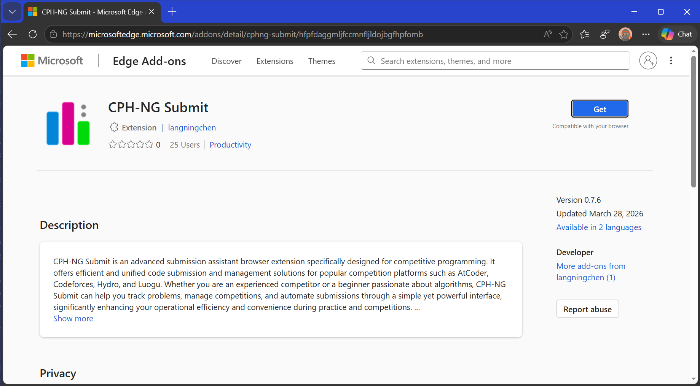
2. Click `Add extension` in the confirmation dialog that appears.
   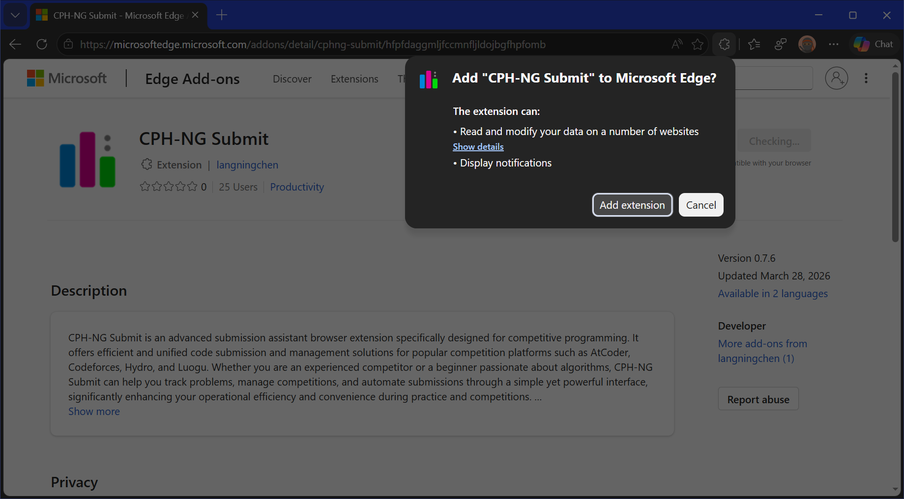
3. Once installed, you'll see a confirmation message. The extension icon should appear in your browser toolbar.
4. Pin the extension to your toolbar for easy access by clicking the extensions icon and selecting the pin icon next to CPH-NG Submit.

##### Option 2: Install from GitHub Releases

Use this method if you want to install a specific version or if the extension is not available in your region.

1. Navigate to the [GitHub Releases page](https://github.com/langningchen/cph-ng/releases) and locate the latest release.
   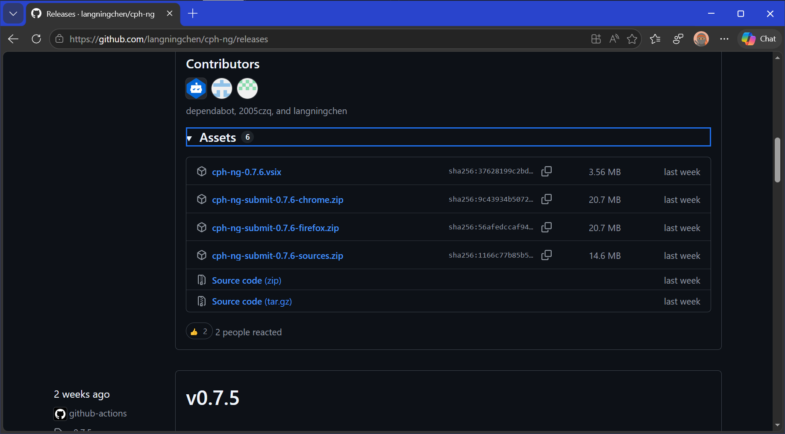
2. Download the `cph-ng-submit-x.x.x-chrome.zip` file (where `x.x.x` is the version number).
3. Extract the ZIP file to a permanent location on your computer (e.g., `C:\BrowserExtensions\cph-ng-submit`). **Important:** Don't delete this folder after installation, as the browser will reference it.
4. Open Microsoft Edge and navigate to `edge://extensions/`.
5. Enable `Developer mode` by toggling the switch in the bottom-left corner.
   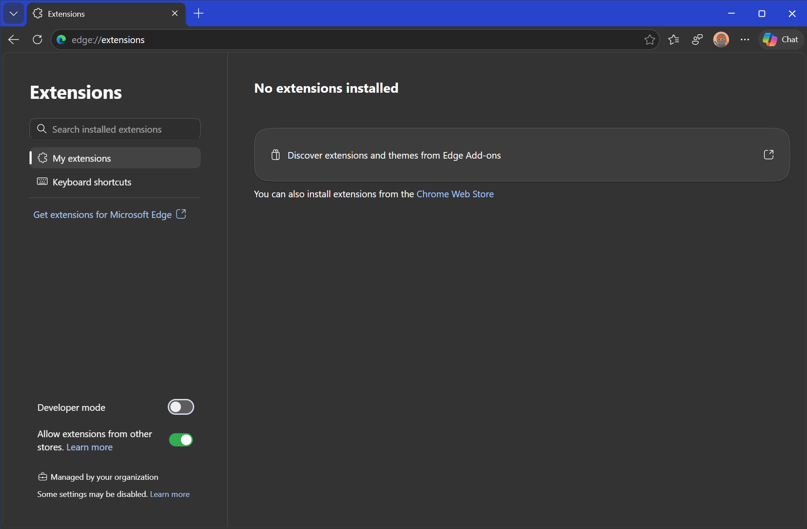
6. Click the `Load unpacked` button that appears after enabling Developer mode.
   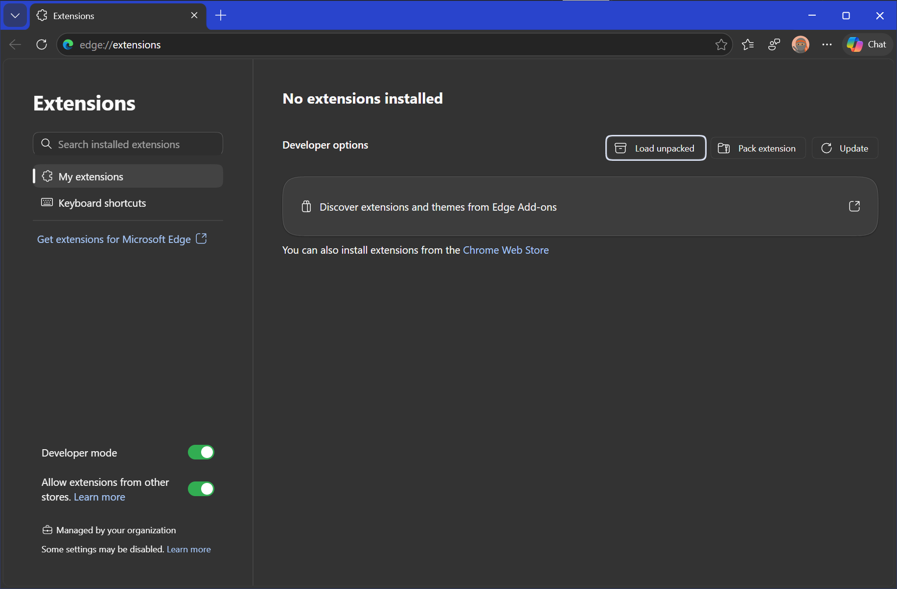
7. Browse to and select the folder where you extracted the extension files.
8. The extension will now appear on the Extensions page with a `Developer mode` label.
   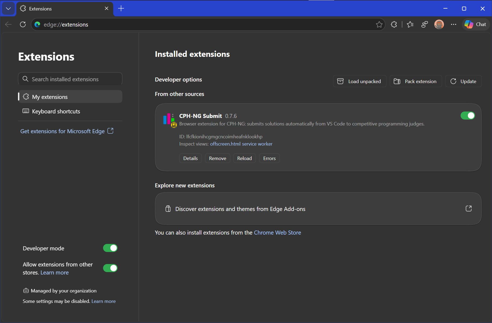
9. **Note:** When installing from GitHub Releases, you won't receive automatic updates. You'll need to manually download and install new versions.

#### Chrome

##### Install from the Chrome Web Store

**Note:** CPH-NG Submit is currently pending approval on the Chrome Web Store. This section will be updated once it's available.

##### Install from GitHub Releases

1. Navigate to the [GitHub Releases page](https://github.com/langningchen/cph-ng/releases) and locate the latest release.
   
2. Download the `cph-ng-submit-x.x.x-chrome.zip` file (where `x.x.x` is the version number).
3. Extract the ZIP file to a permanent location on your computer (e.g., `C:\BrowserExtensions\cph-ng-submit` on Windows, or `~/BrowserExtensions/cph-ng-submit` on macOS/Linux). **Important:** Don't delete this folder after installation.
4. Open Google Chrome and navigate to `chrome://extensions/`.
5. Enable `Developer mode` by toggling the switch in the top-right corner.
   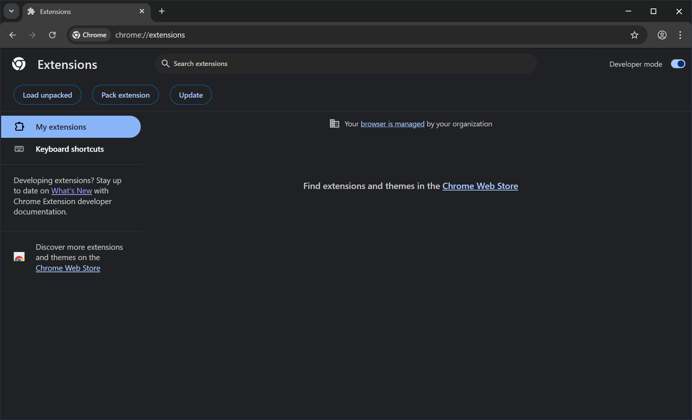
6. Click the `Load unpacked` button that appears after enabling Developer mode.
7. Browse to and select the folder where you extracted the extension files.
8. The extension will now appear on the Extensions page.
   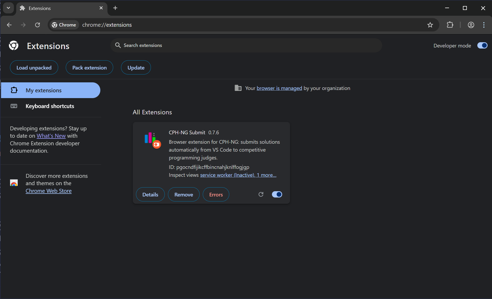
9. For easier access, pin the extension to your toolbar by clicking the extensions icon (puzzle piece) and selecting the pin icon next to CPH-NG Submit.
10. **Note:** Chrome may display warnings about extensions installed in Developer mode. This is normal for manually installed extensions.

#### Firefox

##### Option 1: Install from the Firefox Add-ons Store (Recommended)

This is the preferred method as it provides automatic updates and better security.

1. Visit the [Firefox Add-ons Store](https://addons.mozilla.org/en-US/firefox/addon/cph-ng-submit/) and click `Add to Firefox`.
   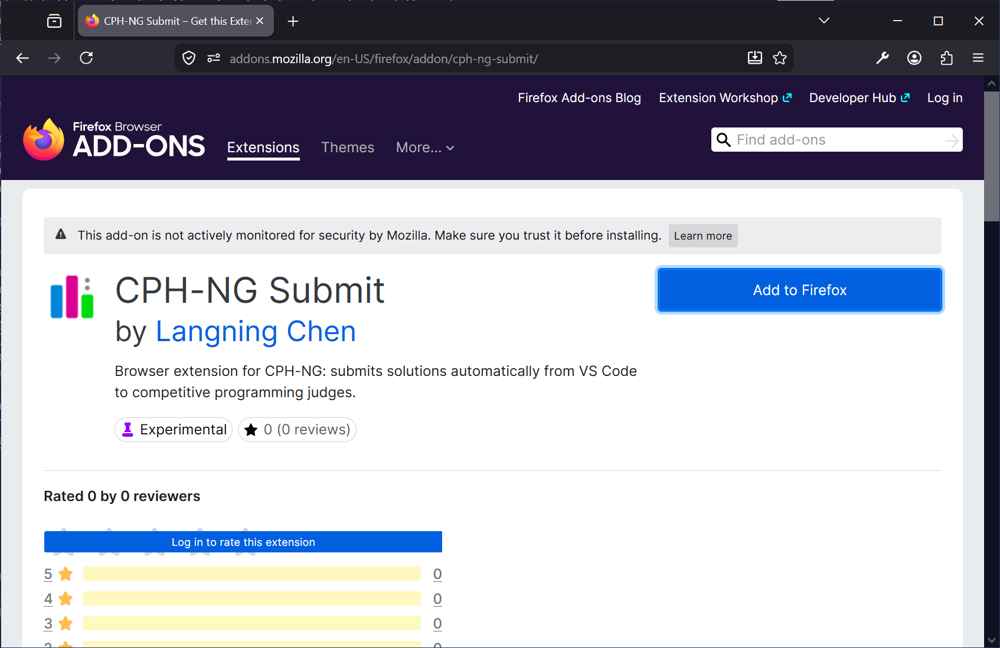
2. A permission dialog will appear showing what the extension can access. Review the permissions and click `Add`.
   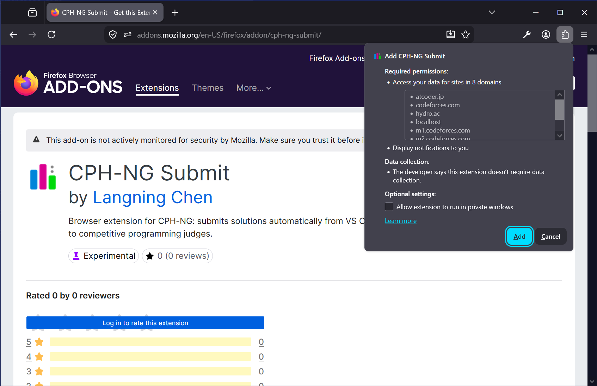
3. Once installed, you'll see a confirmation message. The extension icon will appear in your toolbar.
4. Click on the extension icon to configure settings if needed.

##### Option 2: Install from GitHub Releases

This method requires disabling Firefox's extension signature verification, which may reduce security. Only use this if necessary.

1. Navigate to the [GitHub Releases page](https://github.com/langningchen/cph-ng/releases) and locate the latest release.
   
2. Download the `cph-ng-submit-x.x.x-firefox.zip` file (where `x.x.x` is the version number). **Important:** Do not extract this ZIP file.
3. Open Firefox and type `about:config` in the address bar, then press Enter.
4. Click `Accept the Risk and Continue` when prompted.
   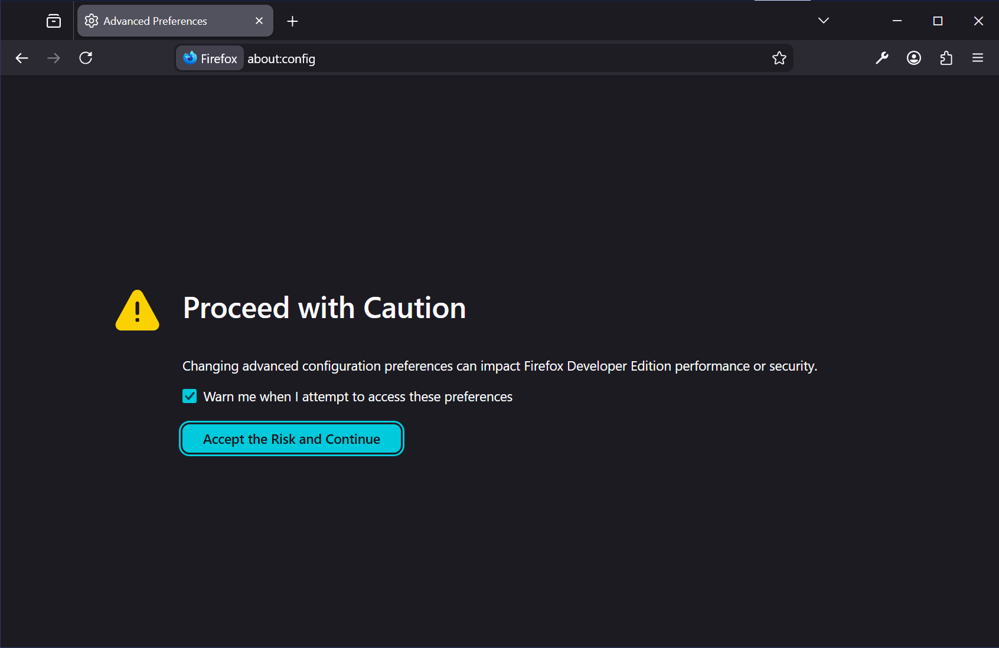
5. In the search bar, type `xpinstall.signatures.required`.
6. Click the toggle button to set the value to `false`.
   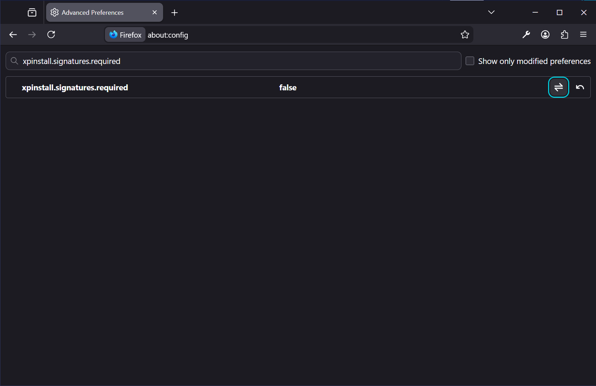
   **Warning:** This setting reduces browser security by allowing unsigned extensions. Consider re-enabling it after installation.
7. Navigate to `about:addons` in the address bar.
8. Click the gear icon (⚙️) near the top of the page.
9. Select `Install Add-on From File...` from the dropdown menu.
   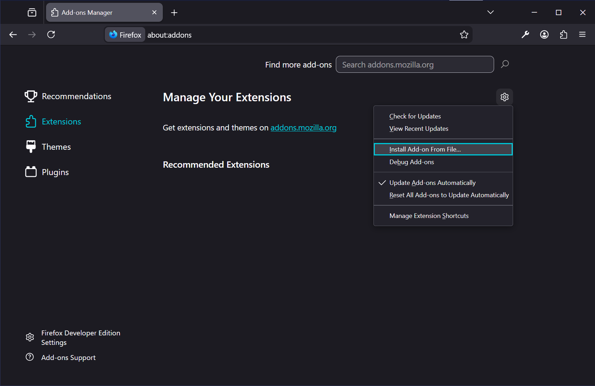
10. Browse to and select the downloaded ZIP file (do not extract it first).
11. Click `Add` in the confirmation dialog that appears.
    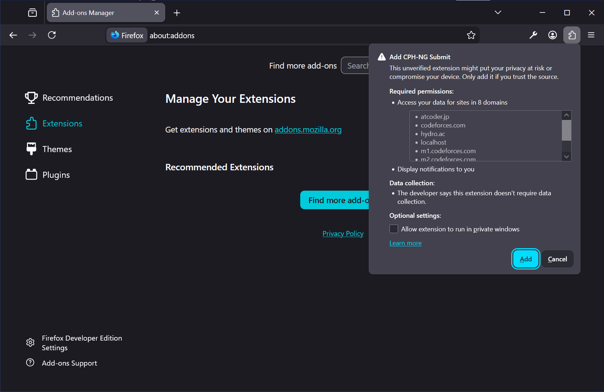
12. The extension will now appear on the Add-ons page.
    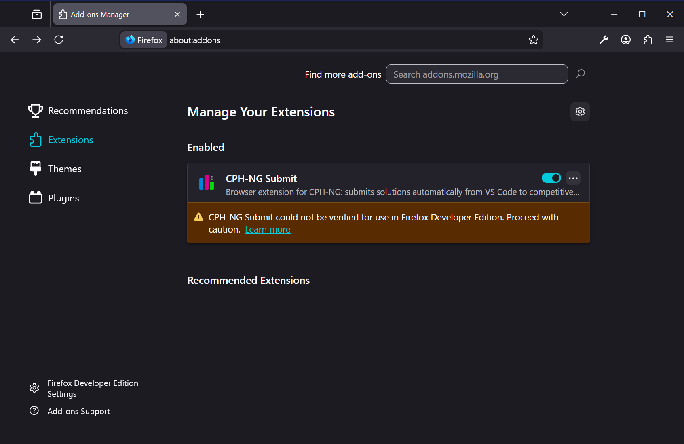
13. **Note:** Extensions installed this way will not receive automatic updates.

#### Other Browsers

CPH-NG Submit is compatible with any Chromium-based browser, including:

- **Brave**: Follow the [Chrome installation steps](#chrome). Navigate to `brave://extensions/` instead.
- **Opera**: Follow the [Chrome installation steps](#chrome). Navigate to `opera://extensions/` instead.
- **Vivaldi**: Follow the [Chrome installation steps](#chrome). Navigate to `vivaldi://extensions/` instead.
- **Arc**: Follow the [Chrome installation steps](#chrome). Navigate to `arc://extensions/` instead.
- **Any other Chromium-based browser**: Use the Chrome installation method with the appropriate extensions URL.

### Troubleshooting

If you encounter issues with the CPH-NG Submit extension, try these troubleshooting steps:

#### Extension Not Connecting to VS Code

1. Ensure both the VS Code extension and browser extension are installed and enabled.
2. Check that the port numbers match in both extensions (default: 27121).
3. Verify that your firewall isn't blocking local connections on that port.
4. Try restarting both VS Code and your browser.

#### Submission Failing

1. Ensure you're logged into the online judge platform in your browser.
2. Check that the problem URL is correct and supported.
3. Verify that your code doesn't exceed the platform's size limits.

#### Checking Extension Logs

For detailed error information:

1. Open your browser's Extensions page:
   - **Edge/Chrome**: Navigate to `edge://extensions/` or `chrome://extensions/`
   - **Firefox**: Navigate to `about:addons`
2. Find CPH-NG Submit and click `Details` or the extension name.
3. Look for debugging options:
   - **Edge/Chrome**: Under `Inspect views`, click `service worker` to open the DevTools console.
   - **Firefox**: Click `Inspect` to open the debugger.
4. Check the console for error messages or warnings.
5. You can also check the network tab to see if requests are being sent correctly.

#### Reporting Issues

If you continue to experience problems, first check existing issues on the [GitHub repository](https://github.com/langningchen/cph-ng/issues). If your issue isn't listed, create a new issue with the log details and steps to reproduce the problem.

## Competitive Companion

Competitive Companion is a powerful browser extension that fetches problem test cases from online judge platforms and imports them directly into the CPH-NG VS Code extension. It supports over 80 competitive programming websites, eliminating the need to manually copy test data.

### Installation

Competitive Companion is available for both Chrome-based browsers and Firefox:

- **Chrome, Edge, and other Chromium browsers**: Install from the [Chrome Web Store](https://chromewebstore.google.com/detail/competitive-companion/cjnmckjndlpiamhfimnnjmnckgghkjbl)
- **Firefox**: Install from the [Firefox Add-ons Store](https://addons.mozilla.org/en-US/firefox/addon/competitive-companion/)
