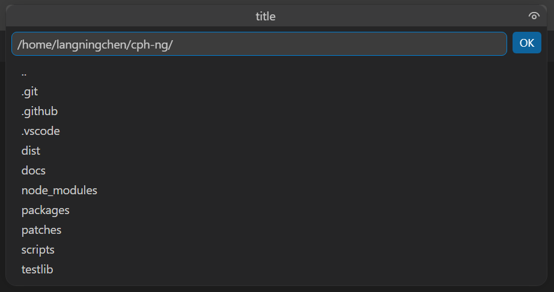
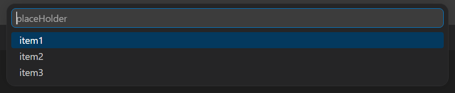
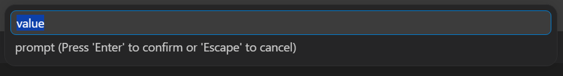

# User Script

User scripts allow you to customize file saving behavior during problem import using JavaScript. You can dynamically determine where code files are stored based on problem metadata (such as contest name, problem title, or source website) and gather user input through an interactive UI.

## Use Cases

- **Custom File Organization**: Create personalized directory structures that match your workflow
- **Platform-Specific Naming**: Apply different naming conventions for different online judges
- **Dynamic Path Generation**: Generate file paths based on problem URL, name, time limit, or other metadata
- **Interactive Workflows**: Prompt users to select folders or enter custom information during import

## Getting Started

### Step 1: Create Your Script

Create a JavaScript file (e.g., `my-script.js`) with the following basic structure:

```javascript
async function process() {
  // Your custom logic here
  return [
    "/absolute/path/to/problem1.cpp",
    "/absolute/path/to/problem2.cpp"
  ];
}
```

For reference, see the [default script](https://github.com/langningchen/cph-ng/blob/main/packages/vscode-ext/res/defaultScript.js) in the GitHub repository.

### Step 2: Configure the Script Path

1. Open VS Code Settings (<kbd>Ctrl</kbd>+<kbd>,</kbd> or <kbd>Cmd</kbd>+<kbd>,</kbd>)
2. Search for `cph-ng.companion.customPathScript`
3. Enter the absolute path or workspace-relative path to your script

### Step 3: Test Your Script

When you parse problems from the browser extension, your script will execute automatically.

## Return Values

The `process()` function must return one of the following:

| Return Type | Description |
| :--- | :--- |
| `(string \| null)[]` | An array with the same length as `problems`. Each element is an absolute file path, or `null` to skip that problem. |
| `string` | An error message to display to the user. This will abort the import process. |

## API Reference

### Global Variables

#### `problems`

An array of `CompanionProblem` objects representing the problems being imported.

| Property | Type | Description | Example |
| :--- | :--- | :--- | :--- |
| `name` | `string` | Problem name | `G. Castle Defense` |
| `group` | `string` | Contest or group name | `Codeforces - Educational Codeforces Round 40 (Rated for Div. 2)` |
| `url` | `string` | Problem URL | `https://codeforces.com/problemset/problem/954/G` |
| `interactive` | `boolean` | Whether the problem is interactive | `false` |
| `memoryLimit` | `number` | Memory limit in MB | `256` |
| `timeLimit` | `number` | Time limit in milliseconds | `1500` |

> For the complete data format, see the [Competitive Companion documentation](https://github.com/jmerle/competitive-companion?tab=readme-ov-file#the-format).

#### `workspaceFolders`

An array of `WorkspaceFolderContext` objects representing the current VS Code workspace folders.

| Property | Type | Description |
| :--- | :--- | :--- |
| `path` | `string` | Absolute path of the workspace folder |
| `name` | `string` | Display name of the workspace folder |
| `index` | `number` | Zero-based index of the workspace folder |

### Path Utilities

All functions from Node.js's `path` module are available for handling file paths.

| Function | Description |
| :--- | :--- |
| `path.join(...paths)` | Join path segments |
| `path.basename(path[, suffix])` | Get the filename portion of a path |
| `path.dirname(path)` | Get the directory portion of a path |
| `path.extname(path)` | Get the file extension |
| `path.normalize(path)` | Normalize a path |
| `path.isAbsolute(path)` | Check if a path is absolute |

> For detailed documentation, see the [Node.js Path API](https://nodejs.org/api/path.html).

### File System Utilities

| Function | Description |
| :--- | :--- |
| `fs.existsSync(path)` | Check if a file or directory exists |

### Custom Utilities

| Function | Description |
| :--- | :--- |
| `utils.sanitize(name)` | Remove illegal filename characters (`\ / : * ? " < > \|`) and replace them with underscores |

### Other Built-ins

The following are also available:

- `URL` class for parsing URLs ([MDN documentation](https://developer.mozilla.org/docs/Web/API/URL))
- Standard JavaScript globals: `JSON`, `Math`, `Date`, `Array`, `Object`, etc.

### Logging

Log messages are written to VS Code's Output panel under the **CPH-NG User Script** channel.

| Function | Description |
| :--- | :--- |
| `logger.trace(message, ...args)` | Log trace-level messages |
| `logger.debug(message, ...args)` | Log debug-level messages |
| `logger.info(message, ...args)` | Log informational messages |
| `logger.warn(message, ...args)` | Log warnings |
| `logger.error(message, ...args)` | Log errors |

> **Note**: Log output appears in the Output panel, not in user-facing dialogs. To display errors to users, return an error message string from `process()`.

### Interactive UI

Scripts can pause execution to gather user input.

#### `ui.chooseFolder(title?)`

Opens a folder selection dialog.

- **Parameters**: `title` (optional) — Dialog title
- **Returns**: `Promise<string | undefined>` — Absolute path of the selected folder, or `undefined` if cancelled



#### `ui.chooseItem(items, placeHolder?)`

Opens a quick pick list.

- **Parameters**:
  - `items` — Array of options to display
  - `placeHolder` (optional) — Placeholder text
- **Returns**: `Promise<string | undefined>` — Selected item, or `undefined` if cancelled



#### `ui.input(prompt?, value?)`

Opens a text input box.

- **Parameters**:
  - `prompt` (optional) — Input prompt text
  - `value` (optional) — Default value
- **Returns**: `Promise<string | undefined>` — User input, or `undefined` if cancelled



## Best Practices

### Type Checking

For a better development experience with IntelliSense and type checking, we provide a TypeScript declaration file.

1. Download `cph-ng.d.ts` from the [GitHub repository](https://github.com/langningchen/cph-ng/blob/main/packages/vscode-ext/res/cph-ng.d.ts)
2. Place it in the same directory as your script
3. Add a reference directive at the top of your script:

```javascript
/// <reference path="./cph-ng.d.ts" />

/**
 * @returns {(string | null)[] | string}
 */
async function process() {
  // Your code here
}
```

### Path Handling

- **Always return absolute paths** — Use `path.isAbsolute()` to verify
- **Use `path.join()` for concatenation** — Avoid manual string concatenation to ensure cross-platform compatibility

```javascript
// ✓ Good
const filePath = path.join(workspaceFolders[0].path, "problems", fileName);

// ✗ Bad
const filePath = workspaceFolders[0].path + "/problems/" + fileName;
```

### Filename Sanitization

Always sanitize problem names before using them as filenames:

```javascript
const safeName = utils.sanitize(problems[0].name);
```

### Error Handling

- Return an error message string to abort the import and notify the user
- Use `logger.error()` for debugging information that doesn't require user action

```javascript
async function process() {
  if (workspaceFolders.length === 0) {
    return "No workspace folder is open. Please open a folder first.";
  }
  // ...
}
```

## Limitations

| Limitation | Details |
| :--- | :--- |
| **Timeout** | Scripts must complete within 2000 milliseconds |
| **Sandbox** | Scripts run in a secure sandbox with limited module access |

## Debugging

1. Open the Output panel: **View → Output**
2. Select **CPH-NG User Script** from the dropdown
3. Add `logger.info()` calls to your script
4. Re-parse a problem to see the output
