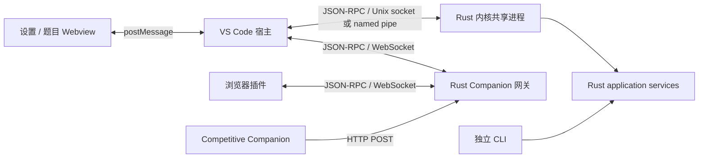

# Rust 内核与客户端职责

评测配置由 Rust 拥有。编译与评测设置已离开 VS Code 内置设置；仍未迁移的样例扫描、模板和旧迁移设置见 [迁移审计](migration-audit.md)。`CPH-NG: Open Kernel Settings` 打开完整设置 Webview，通过 RPC 读取和保存内核配置。CLI、设置页和评测使用同一个配置服务，插件不再生成题目 TOML，也不再为每次运行注入 VS Code 的比较设置。

## 职责边界

| 内容 | 实现位置 |
| --- | --- |
| 编译器、解释器、参数与工具链发现 | Rust；探测实际执行主机的 PATH，选择后才持久化 |
| 编译时限、比较策略、输出限制、对拍轮数、新题默认资源 | Rust 配置 |
| 已保存题目的时限、内存、checker、interactor、generator | Rust 题目数据，`problem.update`；CLI 与题目界面共用 |
| 评测、进程树取消、队列、历史、测试数据、题目标识 | Rust application / domain / infrastructure |
| Companion HTTP 接入、批次聚合与认领、浏览器选择和提交转发 | Rust `router` 子命令 |
| 编辑器文档保存、文件选择、VS Code 命令、状态栏、Webview | VS Code 宿主适配 |
| 展开状态、隐藏状态、当前要运行的测试点选择 | 客户端 UI 状态；运行选择转换成 `testcase_ids` |
| 站点 DOM 操作、浏览器标签页和验证码运行时 | 浏览器插件 |
| 样例 ZIP/目录扫描、配对与导入策略；旧格式发现/升级 | 尚在 VS Code，属于后续应迁到 Rust 的业务逻辑 |
| 模板渲染、文件复制/移动与路径策略 | 部分仍在 VS Code；宿主上下文解析和业务文件操作需要进一步拆分 |

RPC 是边界，不会让客户端包消失。客户端仍要把按钮、文档和浏览器操作转换成请求，再把结果呈现给用户。语言策略现在只是工具链 RPC 与已有语言界面之间的适配，不执行 PATH 扫描或启动编译器探测。导入 UI 和用户脚本上下文继续保留；解压、配对、复制事务等业务逻辑仍需迁移，不能因为已使用 RPC 就认为迁移完成。已弃用的 wrapper/runner/hook 开关不会复活另一套 TypeScript 评测实现。

## 题目、源码和共享包

题目 ID 拥有测试点、判题标准与配置；源码 ID 拥有文件位置，任务和历史同时记录题目 ID 与源码 ID。`problem.link` 显式把另一份源码关联到同题，`history.list SOURCE` 按源码隔离，按 problem_id 才汇总全题。VS Code 的运行和历史请求包含当前 source_path；移动携带 code_id，避免选择成主源码。

原生 `.cph` 包及 Companion JSON、旧 `.prob/.bin` 均有配对的导入导出。内核统一执行格式转换、损失预览、force 检查、路径校验和 ID 重映射。复制保留的 xattr 只是候选线索，原路径尚在时拒绝自动继承身份。SQLite schema 2 从旧单源码模型迁移，保留原有历史归属。详细行为与 fish 补全安装见 [题目共享说明](exchange.md)。

## 配置与迁移

有效配置按字段合并：内置默认 → store 的 `config.toml` → `problems/<UUID>/config.toml` → 内核进程的 `CPH_` 环境变量。`config.get` 与实际编译使用相同规则。环境变量属于进程环境，改变启动环境需重启内核。

设置页可切换全局/当前题目，显示配置路径、来源、本层值和继承值，支持表单、参数数组、工具链检测和原始 TOML。保存先由 Rust 校验，再原子替换；`expected_raw_toml` 防止旧页面覆盖另一窗口的新修改。清空字段通过 JSON merge patch 的 null 删除本层覆盖。手工写坏配置时可以从设置页打开实际配置文件修复。

题目配置中的 `[problem]` 不是已保存题目的资源限制。设置页在题目范围隐藏该组；已保存的限制在题目详情或 `problem update` 编辑。新任务在进入队列时冻结有效配置并写入任务/历史，后续保存仅影响新任务。重新提交已有幂等请求仍读取原任务。

旧 VS Code 配置通过设置页的“预览导入 / 应用导入”显式迁移。只导入实际设置过的可映射字段，保留目标 TOML 已有值；迁移成功才记录该范围已导入。旧题目的编译覆盖保留为待迁移数据，不再从 globalState 恢复成内核运行输入。无对应 Rust 行为的旧执行开关不自动转换。

默认 VS Code store 沿用原插件数据目录，避免丢失已有题目；设置页显示实际路径。独立 CLI 若要访问这些数据，应指定相同 `--store-root`。配置归属不依赖文件是否位于 VS Code 的存储目录，所有读写规则和内容均由 Rust 管理。

## 通信与生命周期



同一主机、同一 store 使用一个评测进程。VS Code 先连接确定的本机 IPC 地址，没有服务时启动打包内核，随后 `system.attach` 注册工作区根。多窗口启动由 store 锁协调；客户端不删除 socket。Unix socket 在当前用户的私有目录内，Rust 在持有 store 锁后处理崩溃留下的 socket。Windows 使用本机 named pipe。

关闭窗口只断开它的 socket/pipe，不向共享服务发 `system.shutdown`；活动任务继续执行。重连通过任务 ID 和事件序号补读结果，服务退出后客户端可重新启动。共享服务常驻到显式 shutdown 或进程信号；`stdio` 保留为单个调用方拥有的子进程模式，stdin EOF 会结束它的任务。

浏览器不能直接访问 Unix socket 或 named pipe。网关使用标准 WebSocket，一帧一个 JSON-RPC 消息；不再使用 Socket.IO。选择这一方式可同时保留 Companion 的 HTTP 接口，不要求用户另装每种浏览器的 Native Messaging host。浏览器官方的 Native Messaging 需要安装并注册 host，且使用带长度前缀的消息，不是现有 JSONL stdio 的直接替换。[Chrome Native Messaging](https://developer.chrome.com/docs/extensions/develop/concepts/native-messaging)

Webview 继续通过 VS Code 的 `postMessage` 与宿主通信，宿主只允许设置页约定的操作；没有给 Webview 开放任意 RPC 转发或本机 HTTP 执行接口。[VS Code Webview 消息通信](https://code.visualstudio.com/api/extension-guides/webview#scripts-and-message-passing)

远程 SSH、WSL 和容器中，内核与工具链检测在扩展执行主机运行。本地浏览器连接远程网关需要把远端网关端口转发到本机，例如 SSH 的 `-L 27121:127.0.0.1:27121`；仅使用远端 PATH 中的工具链。此版本不会自动将远端服务暴露到公网。

## 浏览器配对与 Companion

```sh
cph-ng-judge --store-root DIR config --scope router show --json
cph-ng-judge --store-root DIR router serve
# 在网关停止时修改端口；默认 27121
cph-ng-judge --store-root DIR config --scope router set --port 27122
```

`config --scope router show --json` 由 Rust 初始化并读取 `store/router/config.toml`，返回 JSON `{port,token}`；不要把该输出当普通日志收集。网关配置与执行 store 的锁分开，凭据不会进入可分享的题目配置。旧 `router set` 隐藏兼容，`router info` 保留旧客户端的 JSON 发现入口，新客户端读取使用 config。VS Code 会自动启动同一二进制的网关子命令；旧 `vscode-router` Node 包及打包复制步骤已移除。

在 VS Code 运行 `CPH-NG: Copy Browser Pairing Token`，把令牌粘贴到浏览器插件弹窗的配对输入框，保存并连接。浏览器保存的端口和令牌是客户端连接偏好。网关只监听 `127.0.0.1`，检查 Host 和 Origin，WebSocket 首条 `router.hello` 必须携带配对令牌；凭据不放在 URL。浏览器来源不能声明编辑器角色。

网关只提供批次、状态和提交转发，不开放题目文件读写、配置修改或任意评测 RPC。Competitive Companion 的兼容 `POST /` 不要求配对令牌，只接收有界的导入数据并由编辑器导入；拒绝普通网页 Origin，允许浏览器扩展或无 Origin 的本机请求。导入并不执行代码。

完整批次保留到编辑器成功认领并确认完成；认领在 Rust 中串行检查，其他窗口不能重复认领。断线释放认领并重新通知仍连接的编辑器；未处理批次最长保留 10 分钟。单个批次最多 256 题及 3 MiB，保证通知可放入客户端的 4 MiB 消息预算；队列最多 64 批及 32 MiB。广播共享编码后的消息，慢 WebSocket 客户端被断开后可重连恢复。网关在连续 60 秒没有编辑器连接时退出；它不影响独立评测内核。

浏览器提交仍需要用户在 VS Code 触发已有提交操作，网关只转发到当前活动浏览器。批次缓存是内存状态，网关进程崩溃不承诺恢复未导入批次；已经导入到内核的题目仍保存在 SQLite。

## CLI 文本风格

human 输出采用紧凑的标题、摘要、对齐列表和按需展开的诊断：单行程序输出就地显示，多行内容缩进，不在每个字段之间插空行。TTY 与重定向 human 的信息布局一致，颜色仍只在支持的终端启用。JSON/JSONL 保留机器接口，不依赖 human 文案解析。

参考 gh 的“先给摘要，再列记录、最后给下一步”组织方式，而不是逐字段展开内部 JSON。具体命令、退出码和截断规则见 [cli.md](cli.md)。

## 本次验证

Linux x64：70 项 Rust 测试、182 项 VS Code 测试通过，包含真实内核、共享 daemon、多窗口数据合并、WebSocket 网关、四格式往返、源码历史隔离、旧索引迁移和实际 fish 补全。Rust fmt、文件行数约束、严格 Clippy 通过；Windows GNU 目标严格 Clippy 通过，Windows/macOS 原生运行未在本机验证。Chrome/Firefox 浏览器扩展、题目 Webview 和 VS Code bundle 均完成生产构建。

题目编辑使用本地基线、当前草稿与远端值的三方比较，避免旧窗口运行或保存 UI 状态时覆盖其他窗口的数据；同字段同时写入在预检后仍遵循底层 RPC 的最后写入行为。配置文件的保存另有 Rust 端原子比较与替换。
